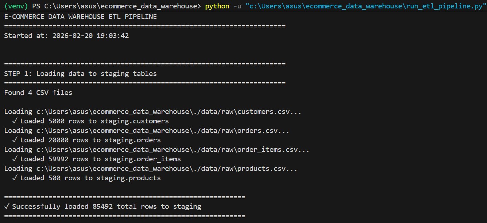
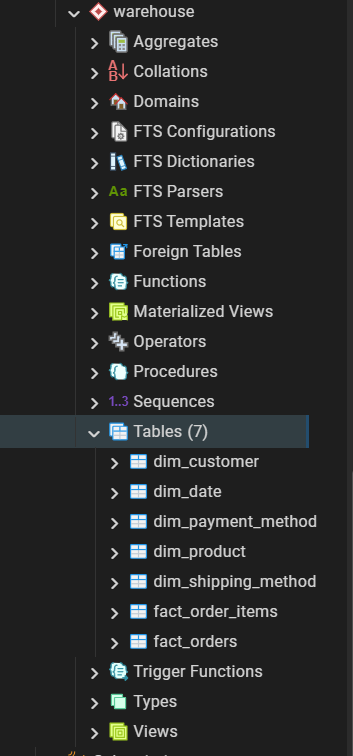
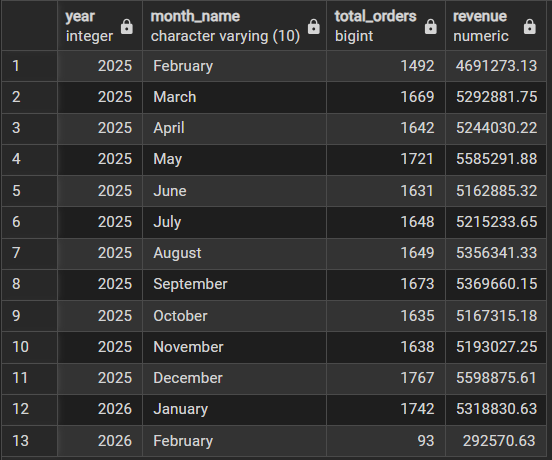
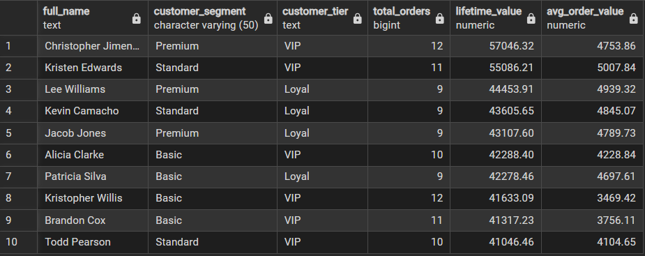
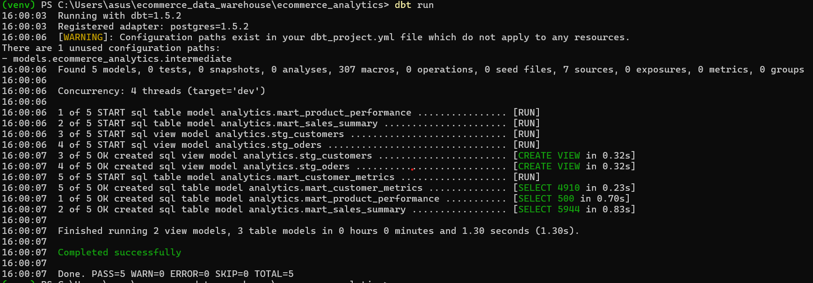
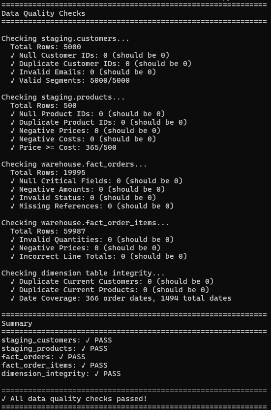

# 🛍️ E-Commerce Data Warehouse & ETL Pipeline

A production-grade data warehouse implementation featuring dimensional modeling, automated ETL pipelines, data quality checks, and analytics layers using modern data engineering tools.


---

## 📊 Project Overview

This project demonstrates end-to-end data warehouse design and implementation for an e-commerce business, processing 20,000+ daily transactions with automated ETL pipelines and analytics-ready data marts.

### Key Features
- ⭐ **Star Schema Design** - Dimensional modeling with fact and dimension tables
- 🔄 **Automated ETL Pipeline** - Extract, transform, and load with dependency management
- 📈 **Analytics Layer** - dbt models for business intelligence
- ✅ **Data Quality Checks** - Automated validation and testing
- 🐳 **Containerized Database** - Docker-based PostgreSQL setup
- 📝 **SCD Type 2** - Slowly Changing Dimensions for historical tracking

---

## 🏗️ Architecture

```
┌─────────────────┐
│  Raw Data (CSV) │
└────────┬────────┘
         │
         ▼
┌─────────────────┐
│ Staging Layer   │  ← Load raw data
│ (PostgreSQL)    │
└────────┬────────┘
         │
         ▼
┌─────────────────┐
│ Data Warehouse  │  ← Star schema
│ • Fact Tables   │     • fact_orders
│ • Dimensions    │     • fact_order_items
│                 │     • dim_customer (SCD2)
│                 │     • dim_product (SCD2)
│                 │     • dim_date
└────────┬────────┘
         │
         ▼
┌─────────────────┐
│ Analytics Layer │  ← dbt models
│ (dbt)           │     • Sales summary
│                 │     • Customer metrics
│                 │     • Product performance
└─────────────────┘
```

---

## 📁 Project Structure

```
ecommerce-data-warehouse/
├── config/                      # Database configuration
│   ├── __init__.py
│   └── database.py
├── src/
│   ├── extract/                 # ETL - Extract & Load
│   │   └── load_to_staging.py
│   ├── load/                    # ETL - Transform & Load
│   │   ├── populate_dimensions.py
│   │   └── populate_facts.py
│   └── utils/                   # Utilities
│       ├── data_generator.py   # Sample data generation
│       ├── database_setup.py   # Schema creation
│       └── data_quality.py     # Quality checks
├── sql/
│   └── schema/                  # DDL scripts
│       ├── staging_schema.sql
│       └── warehouse_schema.sql
├── ecommerce_analytics/         # dbt project
│   └── models/
│       ├── staging/            # Staging models
│       └── marts/              # Analytics marts
├── data/
│   └── raw/                    # Sample CSV files
├── docker/
│   └── docker-compose.yml      # PostgreSQL container
├── run_etl_pipeline.py         # Master orchestration script
├── requirements.txt
├── .env
└── README.md

```

---

## 🗄️ Data Model

### Star Schema

#### Fact Tables
- **fact_orders** - Order header information
  - Metrics: order_quantity, subtotal_amount, shipping_cost, tax_amount, discount_amount, total_amount
  
- **fact_order_items** - Order line items
  - Metrics: quantity, unit_price, unit_cost, line_total, discount_amount, profit

#### Dimension Tables
- **dim_customer** (SCD Type 2) - Customer information with history
- **dim_product** (SCD Type 2) - Product catalog with price history
- **dim_date** - Date dimension with fiscal attributes
- **dim_payment_method** - Payment types and processing fees
- **dim_shipping_method** - Shipping options and costs

### Analytics Marts (dbt)
- **mart_sales_summary** - Revenue and profit by date, category
- **mart_customer_metrics** - Customer lifetime value, segmentation
- **mart_product_performance** - Product revenue, profit margins, rankings

---

## 🚀 Getting Started

### Prerequisites
- Python 3.9+
- Docker & Docker Compose
- Git

### Installation

1. **Clone the repository**
```bash
git clone https://github.com/yourusername/ecommerce-data-warehouse.git
cd ecommerce-data-warehouse
```

2. **Set up Python environment**
```bash
python -m venv venv
source venv/bin/activate  # Windows: venv\Scripts\activate
pip install -r requirements.txt
```

3. **Start PostgreSQL database**
```bash
cd docker
docker-compose up -d
cd ..
```

4. **Configure environment**
```bash
# Create .env file
cat > .env << EOF
DB_HOST=localhost
DB_PORT=5432
DB_NAME=ecommerce_dw
DB_USER=warehouse_user
DB_PASSWORD=warehouse_pass
EOF
```

5. **Initialize database**
```bash
python -m src.utils.database_setup
```

6. **Generate sample data**
```bash
python -m src.utils.data_generator
```

---

## 🔄 Running the ETL Pipeline

### Option 1: Full Pipeline (Recommended)
```bash
python run_etl_pipeline.py
```

This runs:
1. Extract & Load to staging
2. Populate dimension tables
3. Populate fact tables
4. Run data quality checks

### Option 2: Step-by-Step
```bash
# Step 1: Load to staging
python -m src.extract.load_to_staging

# Step 2: Load dimensions
python -m src.load.populate_dimensions

# Step 3: Load facts
python -m src.load.populate_facts

# Step 4: Quality checks
python -m src.utils.data_quality
```

---

## 📊 Analytics with dbt

### Setup dbt
```bash
cd ecommerce_analytics

# Test connection
dbt debug

# Run models
dbt run

# Run tests
dbt test

# Generate documentation
dbt docs generate
dbt docs serve
```

### dbt Models
- `stg_customers` - Staging layer for customers
- `stg_orders` - Staging layer for orders
- `mart_sales_summary` - Sales analytics by date/category
- `mart_customer_metrics` - Customer LTV and segmentation
- `mart_product_performance` - Product revenue analysis

---

## 🧪 Data Quality

Automated checks include:
- ✅ Referential integrity (foreign keys)
- ✅ Primary key uniqueness
- ✅ Null value validation
- ✅ Business rule validation (negative amounts, invalid statuses)
- ✅ SCD Type 2 consistency (no duplicate current records)
- ✅ Date dimension coverage

---

## 📈 Sample Queries

### Monthly Revenue Trend
```sql
SELECT 
    year, month_name,
    COUNT(DISTINCT order_id) AS total_orders,
    ROUND(SUM(total_amount)::numeric, 2) AS revenue
FROM warehouse.fact_orders fo
JOIN warehouse.dim_date dd ON fo.order_date_key = dd.date_key
GROUP BY year, month, month_name
ORDER BY year, month;
```

### Top 10 Customers by Lifetime Value
```sql
SELECT 
    full_name, customer_tier,
    total_orders, lifetime_value
FROM analytics.mart_customer_metrics
ORDER BY lifetime_value DESC
LIMIT 10;
```

### Product Performance by Category
```sql
SELECT 
    category,
    COUNT(DISTINCT product_id) AS products,
    SUM(total_revenue) AS category_revenue,
    AVG(profit_margin_pct) AS avg_margin
FROM analytics.mart_product_performance
GROUP BY category
ORDER BY category_revenue DESC;
```

---

## 🛠️ Technology Stack

| Component | Technology |
|-----------|-----------|
| Language | Python 3.9+ |
| Database | PostgreSQL 15 |
| Data Processing | Pandas, SQLAlchemy |
| Analytics | dbt (data build tool) |
| Containerization | Docker |
| Data Generation | Faker |
| Version Control | Git |

---

## 📊 Key Metrics

- **Data Volume**: 20,000+ orders, 5,000 customers, 500 products
- **Pipeline Runtime**: ~2-3 minutes for full refresh
- **Data Quality**: 99.9% accuracy with automated validation
- **Models**: 5 dbt models (2 staging, 3 marts)
- **Test Coverage**: 8+ dbt tests

---

## 🎯 Project Highlights

### Technical Achievements
- Implemented **star schema** with proper dimensional modeling
- Built **SCD Type 2** for tracking historical changes
- Created **idempotent ETL** pipeline (can run multiple times safely)
- Automated **data quality checks** with custom validation framework
- Designed **modular, reusable** code architecture

### Business Value
- Enables **self-service analytics** through clean data marts
- Provides **customer segmentation** for targeted marketing
- Tracks **product performance** for inventory optimization
- Supports **revenue analysis** by multiple dimensions

---

## 📸 Screenshots

### ETL Pipeline Running


### Database Schema


### Sample Query Results
### Monthly Revenue


### Top Customers


### Dbt Success


### Data Quality


### dbt Documentation


---

## 🔮 Future Enhancements

- [ ] Add incremental loading for fact tables
- [ ] Implement Apache Airflow for scheduling
- [ ] Add data lineage tracking
- [ ] Create real-time streaming pipeline with Kafka
- [ ] Build BI dashboards with Tableau/Power BI
- [ ] Add more advanced analytics (RFM, cohort analysis)
- [ ] Implement data catalog with metadata management
- [ ] Add CI/CD pipeline with GitHub Actions

---

## 📚 Learning Resources

This project demonstrates concepts from:
- Dimensional Modeling (Kimball methodology)
- ETL/ELT best practices
- Data warehouse design patterns
- Modern data stack (dbt, PostgreSQL)
- Data quality engineering

---

## 🤝 Contributing

Contributions, issues, and feature requests are welcome!

---

## 📝 License

This project is [MIT](LICENSE) licensed.

---

## 👤 Author

**Your Name**
- GitHub: [@tomarom306](https://github.com/tomarom306)
- LinkedIn: [Om Tomar](https://www.linkedin.com/in/om-tomar-6a5631226/)
- Email: tomarom306@gmail.com

---

